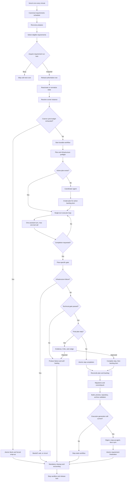

# Code-Agent Harness Architecture Checkpoint

Status: working-tree checkpoint  
Captured: 2026-09-17  
Scope: requirement scheduling, planning, execution, gates, infrastructure recovery, finalization, and cycle accounting

## Purpose

This document records the current harness architecture after the September 2026 reliability refactor. It is intended as a starting point for future agents investigating or changing the harness.

This is a checkpoint, not an eternal source of truth. Before modifying the system, compare this document with the current code and migrations.

## Executive summary

The harness is now a durable state machine rather than a best-effort cron loop.

Its main properties are:

- One canonical scheduler handles every requirement kind.
- A per-requirement run lock prevents normal overlapping workflows.
- The backlog enforces dependency, transition, and WIP=1 invariants.
- The coordinator plans work but does not implement it.
- The executor advances one plan step with at most one tool call per turn.
- Completion requests are advisory until the flow gate approves them.
- Product failures and infrastructure failures use separate budgets.
- Backlog, plan-step, requirement, and accounting mutations have concurrency guards.
- Deployment failures can be recovered by a correlated webhook or fallback scan.
- Requirement finalization is generation-guarded and atomic.

## Active entrypoints

The active scheduler is:

```text
GET /api/cron/requirements-apps
Schedule: every minute
```

It is configured in `vercel.json` and implemented in:

- `src/app/api/cron/requirements-apps/route.ts`
- `src/app/api/cron/requirements-apps/route-state.ts`
- `src/app/api/cron/requirements-apps/workflow.ts`

The scheduler selects all requirement kinds, including automations.

The old automation scheduler is retired:

- `src/app/api/cron/requirements-automations/route.ts` returns HTTP 410.
- `src/app/api/cron/requirements-automations/workflow.ts` was removed.

The separate maintenance/QA harness is paused:

- It is not scheduled in `vercel.json`.
- `src/app/api/cron/maintenance/route.ts` returns before executing its legacy workflow.

## End-to-end lifecycle



## Scheduler stage

`requirements-apps/route.ts` performs the following:

1. Validates `CRON_SECRET`.
2. Runs the recovery prepass.
3. Cleans up or reopens recently terminal requirements when appropriate.
4. Lists candidates in stable `updated_at`, `id` order.
5. Acquires a per-requirement run lock.
6. Reloads the full requirement row after acquiring the lock.
7. Applies scheduled reactivation and backlog normalization.
8. Resolves or creates the canonical `req-runner-<requirement-id>` instance.
9. Enforces the coarse cycle budget.
10. Rejects paused or foreign-active executions.
11. Marks the requirement, instance, and active plan as running.
12. Starts `runCronAppsWorkflow` with the lock ID and execution generation.

The route starts the durable workflow and does not wait for it to finish.

## Backlog model

The backlog is the unit of product work. Important invariants live in:

- `src/lib/services/requirement-backlog-invariants.ts`
- `src/lib/services/requirement-backlog-mutation.ts`
- `src/lib/services/requirement-backlog-store.ts`
- `src/lib/services/requirement-backlog-watchdog.ts`

The current invariants include:

- Item IDs must be unique.
- Dependencies must exist.
- An item cannot depend on itself.
- Dependencies cannot point to a later phase.
- The dependency graph must be acyclic.
- Only one item may be in an active execution/review status.
- Active items require all dependencies to be `done`.
- A `done` item can only be reopened explicitly to `pending`.
- Moving an item to `done` requires approved Judge evidence.

Backlog writes use `requirements.backlog_revision` as an optimistic CAS token. On conflict, pure mutations reload state and replay up to the configured retry limit.

Callbacks passed to atomic backlog mutation helpers must remain free of external side effects because they may run more than once.

## Agent stages

### Coordinator

Implementation:

- `src/app/api/cron/shared/cron-orchestrator-step.ts`

Responsibilities:

- Run the backlog watchdog.
- Preserve WIP=1.
- Escalate stale or over-budget active items.
- Promote the next unblocked item.
- Inspect only enough context to create or update a plan.
- Bind plan steps to the active backlog item.

The coordinator must not implement product code.

Limits:

- Maximum 25 turns.
- Maximum 12 minutes.
- A nudge is injected when it is not progressing toward plan creation.
- Attempts to finish without creating a required plan are overridden up to three times.

### Single-turn executor

Implementation:

- `src/app/api/cron/shared/single-turn-executor.ts`
- `src/app/api/cron/shared/single-turn-prompt.ts`
- `src/app/api/cron/shared/single-turn-step-state.ts`

Each invocation:

1. Connects to or recreates the requirement sandbox.
2. Reloads the plan step.
3. Captures the interaction baseline.
4. Resolves the backlog item binding.
5. Atomically marks the step `in_progress`.
6. Loads role skill, constraints, memories, progress, and retry feedback.
7. Calls the assistant with `enforceSingleTurn: true`.
8. Allows at most one tool call.
9. Routes a completion request into the gate.

The executor does not own final completion. The gate and atomic persistence layer do.

The workflow allows at most 30 turns per step and approximately 11 minutes of step execution per cycle.

### Visual Critic

Implementation:

- `src/app/api/cron/shared/step-visual-critic.ts`
- `src/app/api/cron/shared/visual-critic-client.ts`
- `src/app/api/cron/shared/visual-critic-parser.ts`

The visual critic is an LLM-backed multimodal evaluator. It receives a bounded screenshot set and returns structured output containing:

- pass/fail
- summary
- up to three defects
- category and severity
- route and viewport
- optional fix hint

An unavailable critic is an infrastructure failure. A valid rejecting verdict is a product failure.

### Deterministic Critic and Judge

Implementation:

- `src/app/api/cron/shared/archetype-runner.ts`
- `src/app/api/cron/shared/step-archetype-postgate.ts`

These are currently deterministic rule evaluators, not LLM sessions.

They run only after the technical gate passes for the final plan step associated with a backlog item. They validate:

- executable acceptance criteria
- build/runtime/scenario evidence
- structural feature coverage
- changed files
- admin-only or landing-only delivery patterns
- flow-specific requirements
- persisted constraints

The backlog item becomes `done` only after:

1. The Judge approves.
2. The plan-step completion CAS succeeds.

### Cycle wrap-up agent

Implementation:

- `src/app/api/cron/shared/cycle-wrapup-step.ts`

The wrap-up agent consumes the docs digest, user-action history, plan state, preview, repository, and any blocking reason. It has access only to requirement-status tooling and runs for at most three turns.

Retryable failures remain `in-progress`. Only failures that actually require intervention should produce `blocked`.

## Flow-gate dispatch

The unified dispatcher is `src/app/api/cron/shared/gates/index.ts`.

Current mapping:

- `app`, `site`: application gate
- `automation`: backend gate
- `doc`: document gate
- `presentation`: slides gate
- `contract`: contract gate
- `task`, `makinari`: task gate

Unknown flows fall back to the task gate.

Showcase or "vitrina" build/runtime wrapping is declared but not implemented; those flows currently use their light gate.

## Application gate

The application gate is implemented by:

- `src/app/api/cron/shared/gates/gate-app.ts`
- `src/app/api/cron/shared/step-git-gate.ts`
- `src/app/api/cron/shared/step-gate-probes.ts`

Its effective sequence is:

```mermaid
flowchart LR
    Layout[Repair known layout mistakes] --> Repo[Validate npm/Vercel layout]
    Repo --> Build[npm run build]
    Build --> Interaction[Static interaction audit]
    Interaction --> Runtime[Runtime and API probes]
    Runtime --> Hygiene[Console and copy hygiene]
    Hygiene --> Visual[Visual capture when applicable]
    Visual --> VisualCritic[Visual critic]
    VisualCritic --> Origin[Commit/push verification and recovery]
    Origin --> Deploy[GitHub/Vercel deployment verification]
```



The interaction audit detects:

- internal links without a matching route or asset
- placeholder links
- buttons and controls without meaningful actions

High-confidence missing routes can become deterministic remediation backlog items. Depending on scope policy, remediation either implements the missing route or removes out-of-scope navigation. The active parent item can be suspended until remediation passes.

Automatic visual checks run only for application repositories with frontend changes. The default screenshot budget is:

- one route: mobile and desktop
- two routes: desktop for each route

Full E2E scenario execution remains an explicit/forced QA operation.

## Product failure handling

Examples:

- deterministic build failure
- runtime behavior failure
- client console errors
- interaction defect
- visual rejection
- failed acceptance evidence
- Judge rejection

Product failures:

- can mark the step `failed`
- increment product retry state
- feed the exact failure back into later turns
- invoke deterministic healing

Current healing policy:

1. First failed attempt: rotate implementation strategy.
2. Second failed attempt: reduce scope from `full` to `mvp` to `minimal`.
3. Third failed attempt: core work remains mandatory; ornamental work may be deferred.
4. Fourth and later failed attempts: mark `needs_review`.

`needs_review` releases scheduler pressure but does not count as successful completion.

## Infrastructure failure handling

Examples:

- sandbox unavailable
- probe process throws
- visual critic unavailable
- database state persistence fails
- deployment SHA or preview is temporarily unavailable
- background-command monitoring fails

Infrastructure failures use independent state:

- `infra_retry_count`
- `infra_retry_after`
- `infrastructure_generation`
- `infrastructure_kind`
- `infrastructure_failure_provenance`
- structured correlation data
- circuit and intervention flags

The per-step maximum is four infrastructure failures. SQL computes bounded exponential retry delays before opening the circuit.

Terminal step transitions clear stale infrastructure state. This is enforced by `20260917204000_terminal_step_infrastructure_cleanup.sql`.

## Concurrency and idempotency layers

The harness currently uses:

1. Per-requirement run lock  
   Serializes normal cron workflows.

2. Foreign-instance activity window  
   Reduces concurrent work on the same branch.

3. Backlog revision CAS  
   Prevents stale whole-backlog writes.

4. Plan-step row locks and generation guards  
   Reject stale step mutations.

5. Durable event IDs  
   Make retries of workflow steps idempotent.

6. Requirement execution generation  
   Invalidates workflows started before a user action or recovery.

7. Single-active-plan unique index  
   Prevents concurrent active plans for the same instance.

8. Exactly-once cycle accounting  
   Records each cycle outcome once.

9. Deployment recovery lease  
   Prevents ordinary overlap between fallback recovery scans.

## Deployment recovery

Deployment waits store correlation for:

- requirement
- plan
- step
- branch
- commit SHA
- repository kind
- optional deployment ID

Recovery can be triggered by:

- a Vercel ready/succeeded webhook
- the scheduler recovery prepass and GitHub deployment fallback scanner

Both paths call the same atomic recovery RPC. Recovery requires matching correlation, clears only related infrastructure state, increments generations, resumes eligible steps/plans, reopens the requirement when safe, and resumes the remote instance.

The fallback scanner owns a time-limited global lease. The lease release is owner-checked.

## Delivery and finalization

After execution, the workflow may:

1. Apply database migrations for `app`/`site` flows only after the execution phase exits normally without product or infrastructure failures.
2. Commit and push product work.
3. Run deployment validation and a post-finally build for deployable flows (`app`, `site`, and `automation`); light artifact flows skip these application checks.
4. Resolve the preview URL.
5. Ensure the source archive exists.
6. Validate repository and preview reachability.
7. Check the requirement execution generation.
8. Emit the docs digest.
9. Run the cycle wrap-up agent.
10. Sync repository docs back into backlog state.
11. Atomically finalize the requirement.

A requirement can become `done` only when all required delivery contracts pass:

- plan completed, or legitimately cancelled by sanitation
- push occurred in the current cycle
- repository is valid
- source archive exists
- preview and smoke checks pass for non-light flows
- no blocking post-finally build error
- the backlog closure check passes

Finalization now uses `finalize_requirement_execution_atomic` through:

- `src/lib/services/requirement-finalization.ts`
- `supabase/migrations/20260917203900_atomic_requirement_finalization.sql`

The RPC locks the requirement, validates the execution generation, idempotently writes the cycle status, updates the requirement, resets the instance when complete, and cancels remaining active plans in one transaction.

## Cycle outcomes and circuit breakers

Persisted outcomes include:

- `progress`
- `product_no_progress`
- `product_failure`
- `infrastructure_wait`
- `infrastructure_retry`
- `infrastructure_exhausted`
- `scheduler_cooldown`
- `remediation_handoff`
- `paused`
- `idle`

Important circuits:

- Three consecutive `product_no_progress` cycles trigger a product no-progress block.
- Four consecutive `infrastructure_retry` cycles trigger a cron infrastructure block.
- The route also enforces a coarse cycle budget based on backlog size.

Accounting runs before releasing the requirement lock.

## Reliability appendix

The migration map, ground-truth model, known caveats, safe modification checklist, and primary code map are maintained in:

- [Code-Agent Harness Reliability Appendix](./CODE_AGENT_HARNESS_RELIABILITY_CHECKPOINT_2026-09-17.md)
