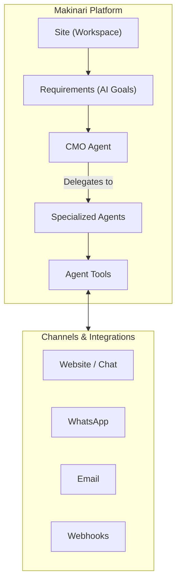

# How Makinari Fits Together

Makinari is a platform that deploys autonomous AI agents to interact with your customers and execute business tasks. Instead of static, rule-based automations, Makinari operates on an objective-based architecture.

## The Architecture

### 1. The Site
Everything in Makinari happens within a **Site**. A Site represents a business, project, or workspace. It holds your brand context, leads, campaigns, and configuration.

### 2. Requirements (AI Goals)
Instead of building workflows block-by-block, you define **Requirements**. A Requirement is a high-level goal (e.g., "Research these leads and draft personalized outreach emails"). 

### 3. The CMO Agent
When a Requirement is activated, the **CMO Agent** acts as the orchestrator. It reads the goal, analyzes the budget, creates a plan, and delegates specific tasks (Commands) to the specialized workers.

### 4. Specialized Agents
Makinari has a fleet of role-specific agents:
- **Sales:** Generates and qualifies leads.
- **Copywriter:** Drafts and edits content.
- **Data Analyst:** Enriches lead data and builds segments.
- **Support:** Answers customer queries based on context.

### 5. Tools and Channels
To execute their tasks, agents use **Tools** (like searching the web, querying the CRM, or sending an email). They communicate with the outside world through **Channels** (Website chat, WhatsApp, Email).

## How you interact with it

You can interact with this system in three ways:
1. **The Dashboard:** Use the visual UI at [app.makinari.com](https://app.makinari.com) to configure Sites, Channels, and Requirements.
2. **The REST API:** Trigger workflows, sync leads, and pull reports programmatically.
3. **The MCP Server:** Connect your local AI tools (like Cursor) directly to the Agent Tools.
