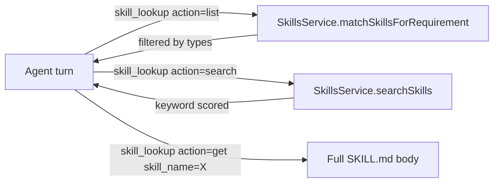

# Agent Skills (`src/skills/`)

Every folder under `src/skills/` is a self-contained **skill** that the platform loads via `SkillsService` ([src/lib/services/skills-service.ts](../lib/services/skills-service.ts)) and exposes to agents through the `skill_lookup` tool ([src/app/api/agents/tools/sandbox/skill-lookup-tool.ts](../app/api/agents/tools/sandbox/skill-lookup-tool.ts)).

This README is the **shared contract**: how skills must be structured, which frontmatter values are valid, and which artifacts they produce or consume.

---

## 1. Skill File Structure

Each skill lives in its own directory with a `SKILL.md` file and optional support files (reference docs, scripts, images).

```
skill-name/
├── SKILL.md              # Required — main instructions (<500 lines)
├── reference.md          # Optional — detailed reference loaded only when needed
└── scripts/              # Optional — utility scripts the agent can run
```

### Required frontmatter

```yaml
---
name: kebab-case-name
description: Third-person description with WHAT and WHEN (<=1024 chars)
types: ['develop', 'automation']
---
```

| Field | Rules |
| --- | --- |
| `name` | Lowercase kebab-case. Must match the folder slug 1:1. Max 64 chars. |
| `description` | Third-person. Include triggering keywords. Must include WHAT the skill does and WHEN to apply it. |
| `types` | One or more values from the **Types Enum** below. Filter surface for `matchSkillsForRequirement`. |

### Required body structure

Every `SKILL.md` body MUST contain these sections, in this order:

1. `# Title`
2. `## Objective` — one paragraph, what the skill achieves.
3. `## Instructions` — numbered, imperative, with examples when useful.
4. `## Tools` — table of tool name + when-to-use. See section 3.
5. `## Artifacts` — what the skill **produces** and **consumes**. See section 4.

Optional sections that appear frequently: `## Environment`, `## Execution Rules`, `## Anti-patterns`, `## Worked Examples`, `## Escalation`.

---

## 2. Types Enum

The `types` frontmatter filters which skills are surfaced for a given requirement type. Use only these values:

| Type | Meaning | Example skills |
| --- | --- | --- |
| `develop` | Write or modify application code (frontend, backend, infra). | `makinari-rol-frontend`, `makinari-rol-backend`, `makinari-rol-devops` |
| `automation` | Build backend automations, webhooks, or scripts with test/prod modes. | `makinari-obj-automatizacion`, `automation-runner` |
| `content` | Author copy, articles, emails, marketing material. | `makinari-rol-content`, `frontend-blog-seo` |
| `design` | Produce visual assets or design-led deliverables (decks, galleries). | `pitch-deck-visuals`, `makinari-obj-vitrinas` |
| `task` | One-off tasks: data extraction, reports, scripted research. | `makinari-obj-tarea` |
| `integration` | Connect to third-party APIs, webhooks, or platform integrations. | `makinari-rol-backend`, `makinari-obj-automatizacion` |
| `planning` | Structure work, plans, requirement instructions, acceptance criteria. | `requirement-author`, `makinari-fase-planeacion` |
| `research` | Investigate context, existing code, memories, brand data. | `makinari-fase-investigacion`, `makinari-obj-tarea` |
| `marketing_campaign` | Campaign-style deliverables (landings, sequences, outreach). | `landing-page-generator`, `saas-landing-page-generator` |
| `optimization` | Tune existing deliverables (SEO, performance, conversion). | `website-seo` |
| `strategy` | High-level strategic artifacts (pitches, positioning). | `pitch-deck-generator`, `pitch-deck-visuals` |

**Rules**
- A skill MAY declare multiple types. Prefer the narrowest set that still matches.
- Do NOT invent new type values without adding them to this table first. Adding a value here is the source of truth.
- The filter in `SkillsService.matchSkillsForRequirement` keeps skills with empty `types` visible for every requirement — use this sparingly, only for utility skills.

---

## 3. Tools Section Standard

Each skill MUST list the tools it relies on as a table, naming tools exactly as the platform exposes them.

```markdown
## Tools

| Tool | When to use |
| --- | --- |
| `sandbox_run_command` | Run shell commands (build, curl, git read operations). |
| `sandbox_write_file` | Create or overwrite files in the working directory. |
| `sandbox_read_file` | Read existing files before editing them. |
| `sandbox_list_files` | Enumerate directory contents before deciding changes. |
| `requirements` | CRUD on the requirement record (read/update `instructions`). |
| `instance_plan` | Create plans and report step execution. |
| `requirement_status` | Publish progress and final delivery URLs. |
```

**Rules**
- Use backticks around tool names so `SkillsService.searchSkills` (keyword scoring in [skills-service.ts](../lib/services/skills-service.ts)) picks them up.
- If a skill has a strong preference between two tools that solve the same problem, mark it explicitly in the "When to use" column (e.g. QA prefers `sandbox_probe_routes` over raw `curl`).
- Never invent tools. If a tool is expected but not yet available, add a note under the table so the orchestrator flags it.

---

## 4. Artifacts Section Standard

Each skill documents the artifacts it reads from or writes to. This lets the orchestrator reason about dependencies without loading every sibling skill.

```markdown
## Artifacts

- **Produces**: `test_results.json` at the repo root (shape defined in `makinari-fase-validacion`).
- **Consumes**: `requirement.instructions` (brain) — never overwrite, only append structured sections.
```

### Canonical artifacts

| Artifact | Shape owner | Description |
| --- | --- | --- |
| `requirement.instructions` (DB field) | `requirement-author` | Persistent "brain" of the requirement. Append-only for downstream skills. |
| `REQUIREMENT.md` (repo root, optional) | `requirement-author` | Markdown snapshot of `requirement.instructions` for humans. |
| `test_results.json` (repo root) | `makinari-fase-validacion` | Build + test outcome consumed by the automated gate. |
| `qa_results.json` (repo root) | `makinari-rol-qa` | QA journey coverage, scenarios, and known gaps. Separate from `test_results.json`. |
| `.qa/scenarios/*.json` (repo) | `makinari-rol-qa` | Declarative E2E scenarios executed by `sandbox_run_scenario`. |
| `INVESTIGATION.md` (repo root, optional) | `makinari-fase-investigacion` | Findings handed off to planning. |
| `instance_plan` (DB record) | `makinari-fase-planeacion` / `makinari-rol-orchestrator` | Ordered execution steps with assigned skills. |
| `requirement_status` (DB record) | `makinari-fase-reporteado` | Client-facing delivery report with URLs. |

**Rules**
- Never collide artifact names. If the semantics differ, rename.
- A skill that **consumes** an artifact cannot silently mutate its shape — mutations must be proposed in the artifact owner's skill first.

---

## 5. Authoring Checklist

Before merging a new or updated skill, verify:

- [ ] Frontmatter `name` matches folder slug.
- [ ] `description` includes both WHAT and WHEN, third person.
- [ ] `types` uses only values from the enum above.
- [ ] Body contains `## Objective`, `## Instructions`, `## Tools`, `## Artifacts`.
- [ ] All tool names are backticked and exist in the platform.
- [ ] Artifacts produced/consumed are listed in the table above, or added there if new.
- [ ] File stays under 500 lines. If it exceeds, move detail to a sibling `reference.md`.
- [ ] No Lorem Ipsum, no mock content, no hardcoded fake data (per project rules).

---

## 6. How Agents Discover and Load Skills



The agent typically (a) lists skills scoped to the requirement type, (b) searches by keywords from its objective, (c) loads the full body of the top match before implementing. Keep `description` and body keywords aligned with the likely search terms of the caller.
